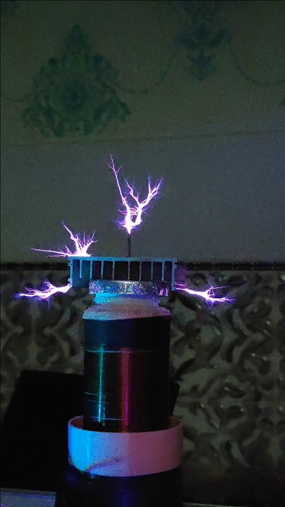
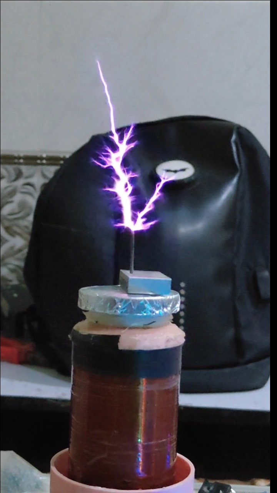
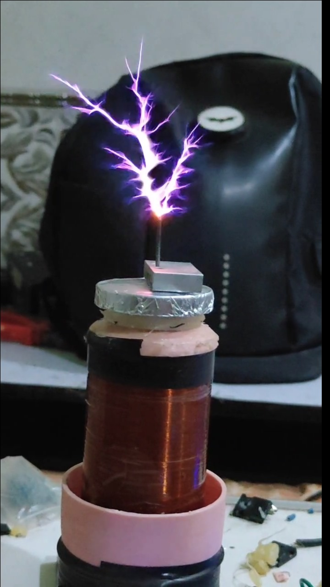
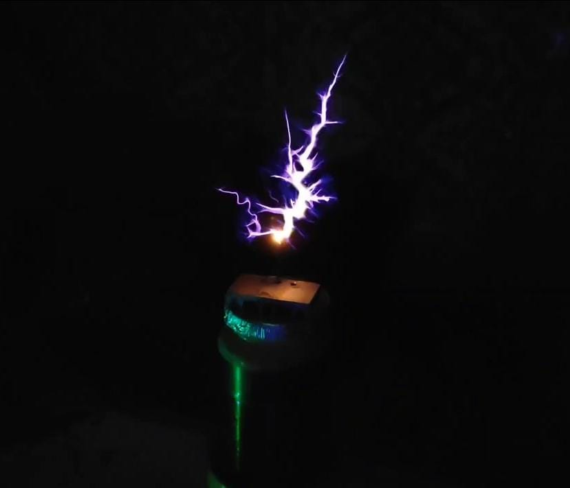
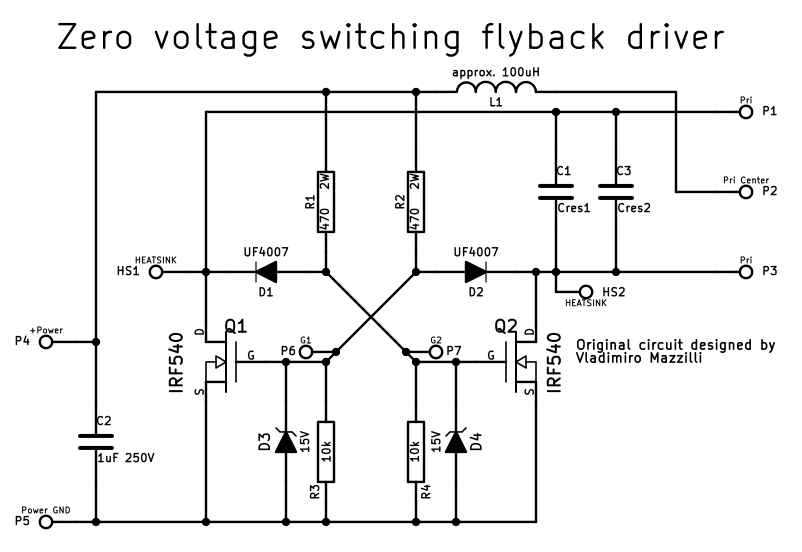

# QCW SSTC – Perfboard Driver, ZVS Step-Up & Arduino-Controlled Buck

## Description
This project demonstrates a **Quasi-Continuous Wave Solid State Tesla Coil (QCW SSTC)** implementation, inspired by and based on the [Low Voltage DC Interrupted SSTC's design thread on High Voltage Forum](https://highvoltageforum.net/index.php?topic=1412.0). The QCW technique uses a **linearly ramped bus voltage** to produce long, sword-like arcs.  

The build combines:  
1. **SSTC V1 Driver** – Assembled on perfboard/zero PCB, based on the HVF thread above.  
2. **ZVS Step-Up Supply** – 24 V → ~120 V DC boost via resonant transformer and rectifier.  
3. **Asynchronous Buck Converter** – Built around **IR2110 + 60N60 IGBT**, controlled by an **Arduino Nano** using PWM ramp code from [this HVF post](https://highvoltageforum.net/index.php?topic=844.msg5655#msg5655).  
   - 20 µF bus capacitor bank supplies the SSTC stage.  

## Features
- Custom **perfboard SSTC driver**  
- **ZVS DC step-up** to ~120 V  
- **Arduino-controlled buck** for QCW bus ramp  
- Modular design allows independent testing of each stage  
- Long, thin, QCW-style spark output  

## Hardware & Files
- `sstcv1.sch` – KiCad schematic for SSTC driver  
- `sstcv1pcb.png` – Perfboard layout / PCB visualization  
- `buck.sch` – KiCad schematic for buck converter  
- `bucksch.pdf` – Printable PDF schematic  
- `sstc_driver_notes.pdf` – Notes & wiring for SSTC driver  
- ZVS driver: standard Mazilli design (generic image included)  

## Media

### Tesla Coil Sparks

  
  
  
  

### Demo Video

  

### Schematics

  <b>SSTC V1 Schematic:</b> <a href="sstcv1.sch">KiCad Source</a> | <a href="sstcv1pcb.pcb">PCB Layout</a> 
  <b>Buck Converter:</b> <a href="buck.sch">KiCad Source</a> | <a href="bucksch.pdf">PDF Schematic</a>

### ZVS Driver Reference

  

## Build Notes
Perfboard assembly required careful routing to minimize parasitics and avoid cross-talk. The buck stage was tuned to produce a smooth rising DC bus voltage into the main SSTC driver. Grounding, decoupling, and lead lengths were optimized to handle high dV/dt switching. The Arduino-controlled ramp ensures quality, sword-like arcs.  

## Safety
⚠️ Working with Tesla coils and high-voltage circuits is dangerous. Isolation, grounding, protective eyewear, and remote testing are mandatory. Only attempt replication if experienced with high-voltage safety protocols.  

## References
- [QCW SSTC Design Thread – High Voltage Forum](https://highvoltageforum.net/index.php?topic=1412.0)  
- [Arduino Ramp Code Thread – High Voltage Forum](https://highvoltageforum.net/index.php?topic=844.msg5655#msg5655)  
- ZVS Driver: Standard Mazilli design  
- [YouTube Demo – Early QCW Coil Test](https://www.youtube.com/watch?v=OTg-Y0lxt5U)
